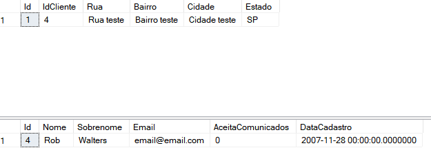

<h1>
    <a href="https://www.dio.me/">
     </a>
    <span> Curso oeferecido pela DIO XP Inc. - Full Stack Developer</span>
</h1>

> ## 📕 O repositório tem como objetivo armazenar resumos e o conteúdo passado em aula sobre Banco de Dados.

# ⭐ Introdução a Banco de Dados
## 🚀 ``Introdução Banco de Dados``
### 1️⃣ Introdução banco de dados
#### 📍 Introdução módulo:

* Aprender os principais conceitos de banco de dados, SQL, comandos, tratamento e junção de dados, com foco em desenvolvimento.

#### 📍Introdução a Banco de Dados:

* Um banco de dados é uma coleção organizada de informações (ou dados) estruturadas, normalmente armazenadas eletronicamente em um sistema no computador.

#### 📍Tipos de banco de dados:

* **Banco de dados relacional**: O tipo mais usado atualmente, armazanando dados estruturados, sendo organizado em tabelas, com colunas e linhas, que se relacionam entre si.

**Exemplo:** SQL Server, Oracle Database e MySQL.

#### 📍Entendendo uma tabela:

* Tabela: São dados estruturados e organizados logicamente em formato de linha e coluna.

#### 📍Banco de dados não relacional:

* **Banco de dados não relacional**: Banco de dados onde os dados não são armazenados em tabela, e sim armazenados de maneira não estruturadas ou semi-estruradas.

* Existem vários tipos: document databases, key-value, databases, wide-column stores e graph databases.

#### 📍Tipos de dados:

* **Dados Semi estruturados:** Arquivo JSON (regras flexíveis).
* **Dados estruturados:** linha e coluna (regras rígidas).

#### 📍Entendendo o DBMS:

* **Database Management System:** É um software utilizado para acessar, manipular e monitorar um sistema de banco de dados.

#### 📍Instalando o SQL Server:
* Instalando banco de dados: https://www.microsoft.com/pt-br/sql-server/sql-server-downloads

* Instalando o SQL Management Studio: https://learn.microsoft.com/pt-br/sql/ssms/download-sql-server-management-studio-ssms?view=sql-server-ver16

> Cadeia de conexão: Server=localhost\SQLEXPRESS;Database=master;Trusted_Connection=True;

## 🚀 ``SQL SERVER - Dominando Tabelas e Tipos de Dados``

### 1️⃣ SQL, tabelas e tipos de dados
#### 📍 Introdução SQL:

* SQL (Structured Query Language): É a linguagem de banco de dados usada para consulta e manipulação de dados.

* DQL - Data Query Language (select) para obter dados
* DML - Data Manipulation Language (Insert, Update, Delete) para manipular dados
* DDL - Data Definition Language (Create Drop, Alter, Truncate) para manipular tabelas

* DCL - Data Control Language  (Grant, Revoke)
* TCL - Transaction Control Language (Commit, Rollback, Sabe Point)

#### 📍 Entendendo um database:

* Database: É uma coleção de dados estruturados, agrupados de forma concisa. É composto de tabelas, procedures, views, etc.

#### 📍 Acessando o banco de dados:

* Abrir o aplicativo 'SQL Server Configuration Manager' para iniciar ou parar o servidor.

* Clicar com o botão direito em Banco de Dados e criar um novo.

* Clicar em 'Nova Consulta' para consultar o banco de dados.

#### 📍 Criando nossa tabela:

* Clicar em aquivo -> abrir -> arquivo -> selecionar o arquivo sql -> clicar em executar -> ícone atualizar.

* Clicar em editar -> Intellissense -> atualizar cache local. 

#### 📍 O comando select:

``SELECT * FROM Clientes`` : mostra os dados da tabela.

#### 📍Ordenando os resultados:

``ORDER BY Nome, Sobrenome`` : Ordena pelo nome, depois pelo sobrenome.

#### 📍Selecionando colunas:
``SELECT Nome, Sobrenome, Email FROM Clientes`` : Mostra somente os dados de Nome, Sobrenome e Email.

#### 📍Utilizando o Where:

* Mostra os dados onde o Nome é igual a Roberto ou o Sobrenome é igual a Tamburello:

~~~~SQL
SELECT * FROM Clientes
WHERE Nome = 'Roberto' OR Sobrenome = 'Tamburello'
ORDER BY Nome, Sobrenome
~~~~

> Podemos utilizar outros operadoes além do OR

* Mostra os dados onde AceitaComunicados é igual a 1:

~~~~SQL
SELECT * FROM Clientes
WHERE AceitaComunicados = 1
ORDER BY Nome, Sobrenome
~~~~

#### 📍Utilizando o Like:

``WHERE Nome LIKE 'R%'`` : busca os registro que comecem com a letra 'R' em Nome.

``WHERE Nome LIKE '%R%'`` : busca os registro que tenham letra 'R' em Nome.

#### 📍:Realizando um INSERT:

* Podemos selecionar o comando que queremos executar.

* Insere dados na tabela:
~~~~SQL
INSERT INTO Clientes (Nome, Sobrenome, Email, AceitaComunicados, DataCadastro)
VALUES ('Leonardo', 'Buta', 'email@email.com', 1, GETDATE())
~~~~

#### 📍INSERT omitindo colunas:

* Ao passarmos os dados sem as colunas, precisamos obedecer a ordem delas.

~~~~SQL
INSERT INTO Clientes VALUES ('Leonardo', 'Buta', 'email@email.com', 1, GETDATE())
~~~~

* Quando passamos dados com as colunas podemos escolher a ordem que queremos passar os dados.

~~~~SQL
INSERT INTO Clientes (Sobrenome, Nome, Email, AceitaComunicados, DataCadastro)
VALUES ('Buta', 'Leonardo', 'email@email.com', 1, GETDATE())
~~~~

> Aqui Sobrenome foi passado antes de Nome

#### 📍Entendendo o ID:

* Não é necessário inserir o id dos dados que queremos inserir no banco.

#### 📍Entendendo o apontamento da query:

Ao iniciar o banco de dados novamente é importante lembar de trocar para o banco correto.

#### 📍Realizando um Update:

* Atualiza o campo Email pelo Id:

~~~~SQL
UPDATE Clientes
SET Email = 'emailatualizado@email.com',
	AceitaComunicados = 0
WHERE Id = 2
~~~~

#### 📍Cuidados com o Update:

* ``BEGIN TRAN``: Deve ser executado antes de fazer alguma atualização crítica

* ``ROLL BACK``: recupera os dados após alguma atualização

* É autamente recomendável utilizar o WHERE ao executar um UPDATE.

#### 📍Deletando um registro:

~~~~SQL

DELETE Clientes
WHERE Id = 7
~~~~

#### 📍Estudando os tipos de dados:

* char: número de caractres fixo
* varchar: limita a quantidade máxima de caracteres
* text: texto até 2GB 
* bit: booleano (0, 1, null)
* decimal: valores decimais
* int e bigint: valores inteiros
* datetime2: data e hora
* date : data
* time: hora

#### 📍Criando uma tabela:

~~~~SQL
CREATE TABLE Produtos (
	Id int IDENTITY(1,1) PRIMARY KEY NOT NULL, -- Chave primária, auto incerementa e não pode ser nulo
	Nome varchar(255) NOT NULL,
	Cor varchar(50) NULL, -- Pode ser nulo
	Preco decimal (13,2) NOT NULL, -- É recomendado usar o decimal para valore smonetários
	Tamanho varchar(5) NULL,
	Genero char(1) NULL
)
~~~~

## 🚀 ``SQL SERVER - Manipulando Dados``

### 1️⃣ Manipulando dados
#### 📍 Introdução:

* Built-in functions são funções pré-existentes que auxiliam na manipulação de dados, como por exemplo contarm somar, média, etc.

#### 📍 Usando o COUNT:

* O COUNT serve para contar quantos itens tem na tabela com uam determinada condição.

~~~~SQL
SELECT COUNT (*) QuantidadeProdutosTamanhoM FROM Produtos WHERE Tamanho = 'M'
~~~~

> Retorna uma linha da tabela com a quantidade de produtos onde o Tamanho é igual a M e com a coluna nomeada de QuantidadeProdutosTamanhoM.

#### 📍 Usando o SUM:

~~~~SQL
SELECT SUM(Preco) PrecoTotalProdutosTamanhoM FROM Produtos WHERE Tamanho = 'M'
~~~~

> Retorna uma linha e uma coluna PrecoTotalProdutosTamanhoM com a soma da coluna de Precos onde o tamanho seja igual a 'M'.

#### 📍 Usando o MIN, MAX, AVG:

~~~~SQL
SELECT MAX(Preco) ProdutoMaisCaro FROM Produtos WHERE Tamanho = 'M' -- Maior valor da coluna Preco na tabela produtos onde o tamanho é igual a M

SELECT MIN(Preco) ProdutoMaisBarato FROM Produtos -- Menor valor da coluna Preco na tabela produtos

SELECT AVG(Preco) Média FROM Produtos -- Média da coluna Preco da tabela produto
~~~~

#### 📍 Conectando colunas:

~~~~SQL
SELECT 
	Nome + ', Cor: ' + Cor + ' - ' + Genero NomeProduto
FROM Produtos
~~~~
> Exemplo de retorno: Mountain Bike Socks, M, Cor: Branco - U

#### 📍 Upper e Lower:

~~~~SQL
SELECT 
	Nome + ', Cor: ' + Cor + ' - ' + Genero NomeProdutoCompleto,
	UPPER(Nome) Nome, -- Retorna os dados da coluna em maiúsculo 
	LOWER(Cor) Cor -- Retorna os dados da coluna em minúsculo 
FROM Produtos
~~~~

#### 📍 Adicionnando uma nova coluna:

**Adiciona coluna de maneira visual:** clicar com o botão direito na tabela -> Design -> Adicionar campo -> CTRL + S.

**Apagar coluna de maneira visual:** clicar com o botão direito na tabela -> Design -> Clicar com o botão direito no campo -> apagar -> CTRL + S.

~~~~SQL
ALTER TABLE Produtos -- Criando uma nova coluna
ADD DataCadastro DATETIME2 -- Adicionando nome da couna e tipo de dado

ALTER TABLE Produtos -- Deletando Coluna
DROP COLUMN DataCadastro  

UPDATE Produtos SET DataCadastro = GETDATE() -- adiconando dados na nova coluna
~~~~

#### 📍 Formatando uma data:

~~~~SQL
SELECT 
	Nome + ', Cor: ' + Cor + ' - ' + Genero NomeProdutoCompleto,
	UPPER(Nome) Nome, -- Retorna os dados da coluna em maiúsculo 
	LOWER(Cor) Cor, -- Retorna os dados da coluna em minúsculo 
	FORMAT(DataCadastro, 'dd/MM/yyyy HH:mm') Data -- Formatando data
FROM Produtos
~~~~

> Exemplo de retorno: 19/09/2024 10:33

#### 📍 Entendendo o Group By:

~~~~SQL
SELECT 
	Tamanho, -- Seleciona o tamanho
	COUNT(*) Quantidade -- Conta a quantidade de cada tamanho
FROM Produtos -- Tabela Produtos
WHERE Tamanho <> '' -- Onde Tamanho seja diferente de vazio
GROUP BY Tamanho -- Agrupa a partir dos dados de Tamanho que são iguais
ORDER BY Quantidade DESC -- Ordena do maior pro menor
~~~~
> Exemplo de retorno: 

|    | Tamanho | Quantidade |
|----|---------|------------|
| 1  | G       | 11         |
| 2  | M       | 11         |
| 3  | P       | 9          |
| 4  | GG      | 3          |

#### 📍 Primaty Key e Foregin Key:

* **Primary Key:** Chave única que identfica cada registro na tabela
* **Foregin Key:** Chave que identifica um registro existente em outra tabela

#### 📍Criando a tabela de Endereços com Foreign Key:

**Adiciona FORIGN KEY na tabela Clientes:** clicar com o botão direito na tabela -> Design -> Clicar com o botão direito em Id -> Adicionar Foreign key -> CTRL + S.

**Criando tabela Enderecos e associando o id de Clientes como chave estrangeira:**

~~~~SQL
CREATE TABLE Enderecos (
	Id int PRIMARY KEY IDENTITY(1,1) NOT NULL,
	IdCliente int NULL, -- Adicionando campo IdCliente
	Rua varchar(255) NULL,
	Bairro varchar(255) NULL,
	Cidade varchar(255) NULL,
	Estado char (2) NULL,

	CONSTRAINT FK_Enderecos_Clientes FOREIGN KEY(IdCliente) -- Criando referência de chave estrangeira
	REFERENCES Clientes(Id)
)
~~~~

**Inserindo dados na tabela enderecos incluindo o id de Cliente**

~~~~SQL
INSERT INTO Enderecos VALUES (4, 'Rua teste', 'Bairro teste', 'Cidade teste', 'SP')
~~~~

~~~~SQL
SELECT * FROM Enderecos WHERE IdCliente = 4
SELECT * FROM Clientes WHERE Id = 4
~~~~
> Retorno:


#### 📍 Realizando um JOIN

~~~~SQL
SELECT
	* -- Seleciona todos os campos
FROM
	Clientes
INNER JOIN Enderecos ON Clientes.Id = Enderecos.IdCliente -- Junta as tabelas onde Clientes.Id e Enderecos.IdCliente são iguais
WHERE Clientes.Id = 4 -- Clientes.Id tem que ser igual a 4
~~~~

> Retorno:

|  | ID | Nome | Sobrenome | Email             | AceitaComunicados | DataCadastro            | ID | ClienteId | Rua        | Bairro       | Cidade        | Estado |
| --- | --------- | ---- | --------- | ----------------- | ----------------- | ----------------------- | ---------- | ------ | ---------- | ------------ | ------------- | ------ |
| 1 | 4         | Rob  | Walters   | email@email.com    | 0                 | 2007-11-28 00:00:00.000 | 1          | 4      | Rua teste  | Bairro teste | Cidade teste  | SP     |

* Podemos apelidar as tabelas no JOIN e específicar os campos que queremos juntar:

~~~~SQL
SELECT
	C.Nome, -- Selecionando a tabela pelo apelido
	C.Sobrenome,
	C.Email,
	E.Rua,
	E.Bairro,
	E.Cidade,
	E.Estado
FROM
	Clientes C -- Apelidando a tabela Clientes com C
INNER JOIN Enderecos E ON C.Id = E.IdCliente -- Junta as tabelas onde Clientes.Id e Enderecos.IdCliente são iguais
WHERE C.Id = 4 -- Clientes.Id tem que ser igual a 4
~~~~

> Retorno:

| Nome | Sobrenome | Email             | Rua        | Bairro       | Cidade        | Estado |
|------|-----------|-------------------|------------|--------------|---------------|--------|
| Rob  | Walters   | email@email.com   | Rua teste  | Bairro teste | Cidade teste  | SP     |


## 🚀 ``Introdução ao MongoDB e Banco de Dados NoSQL``

### 2️⃣ Conhecendo os tipos de banco de dados NoSQL
#### 📍 Tipos de banco NoSQL:

Tipos de banco NoSQL

* Document Store (JSON)
* Key-value
* Wide-Column Store
* Graph Store

**Graph store:**

* São estruturas matemáticas compostas de nós (dados) e vértis (relacionamentos).

* Comum em detecção de fraudes, mecanismos de recomendação, redes sociais, sistemas de arquivos, games.

Vamos criar estrutura de registros que compõem os dados de uma rede social utilizando um sandbox do New4j.

Site: [now4j](https://sandbox.neo4j.com/)

* Criação de nó e relacionamento:

CREATE (:Client {name: "Bob esponja", age: 28, hobbies: ['Caçar agua-viva', 'Comer hamburgues']})

> Client: tipo de label

> {}: propriedades

* Consultando label:

MATCH (bob_esponja) RETURN bob_esponja

> Retorna tudo e aprensenta o conteúdo da variável

* Criação de relacionamentos:

CREATE (:Client {name: "Lula Molusco", age: 30, hobbies: ['Tocar clarinete']}) -[:Bloqueado]->(:Client {name: 'Patrick', hobbies: ['Caçar agua-viva']})

> -[:Bloqueado]->: Cria e redireciona o relacionamento (label)

> Added 2 labels, created 2 nodes, set 5 properties, created 1 relationship, completed after 16 ms.


* Os relacionamentos podem ter ou não uma label
* Não precisamos colocar as mesmas propriedades mesmo que ambos compartilhem da mesma label

* Consultando estrutura:

 MATCH (todos) RETURN todos;

* Criando objeto: 

 CREATE (:Object)

> O objeto tem cor diferente pois não compartilha da mesma label

* Criando relacionamento entre nós existentes
MATCH (lula:Client{name: "Lula Molusco"}), (patrick:Client {name: "Patrick"}) CREATE (lula)-[:Bloqueado]->(patrick)

* Excluindo relacionamento:

MATCH (lula:Client {name: "Lula Molusco"})-[relaciona:Bloqueado]-() DELETE relaciona

> [relaciona:Bloqueado]Na hora de passar o relacionamento, atribui o relacionamento para uma variável

> (): Nó anônimo que exclui os relacionamento que tiverem a label, também podemos utilizar nós específicos.

* Excluindo nó:

MATCH (lula:Client {name: "Lula Molusco"}) DELETE lula;

* Atualizar dado do nó:
MATCH (patrick:Client {name: "Patrick"}) SET patrick.age = 20;

> Relacionamentos também podem ter propriedades

* Atualizando label:
MATCH (patrick:Client {name: "Patrick"}) SET patrick:Client_Premium

#### 📍 Coluna/Família de colunas:

* NoSQL baseado em colunas armazena informações exatamente nas suas colunas de forma independente entre elas.

* Keyspace: agrupamento de famílias de colunas => database.
* Column Family/table: agrupamento de colunas => table.
* Row key: chave que representa uma linha de coluna => Primary Key.
* Column: representa um valor contendo> Name, Value Timestamp.

* O uso ideal é realizar buscas pela chave.

* Se não existe um valor para a coluna a linha dessa coluna não existe

* Utilizando o Cassando iremos criar uma estrutura de banco e realizar operações.

Site: [Oreilly](https://learning.oreilly.com/interactive-lab/cassandra-run-cassandra/9781492080794/lab/)

* Criando keyspace:

``$ CREATE KEYSPACE fenda_biquini WITH replication = {'class':simpleStrategy, 'replication_factor': 1};``

> CREATE KEYSPACE fenda_biquini : criando key space
> WITH replication = : propriedades de replicação
> {'class':simpleStrategy} : propriedades JSON
> 'replication_factor': 1 : fator de replicação

``use fenda_biquini;``
> Usar o keyspace sem precisa rfazer referência

* Criando primeira família de colunas:

``CREATE COLUMNFAMILY clients (name text TEXT PRIMARY KEY, age int);``

> (name text TEXT PRIMARY) : definindo squema e primary key

* Consultando column family:

``SELECT * FROM clients;``


* Inserindo valores:

``INSERT INTO clients (name, age) VALUES ('Bob Esponja', 38);``

* Inserindo JSON:

``INSERT INTO clients JSON '("name": "Patrick")';``
> O registro Ptrick não tem nenhuma referência na coluna de idade ou seja a coluna 'age' só tem um registro.

* Consultando timestamp:

``SELECT age, WRTITELINE(age) FROM clients;``

> Retorna os dados da coluna age.

* Sintaxes de consulta:

1. ``SELECT * FROM clients``
2. ``SELECT * FROM clients WHERE name = 'Bob Esponja'``

* Retornando registros em JSON:

``SELECT JSON * from clients``
> retorna os valores em forma de JSON

>[
  {
    "name": "Bob Esponja",
    "age": 38
  },
  {
    "name": "Patrick",
    "age": 33
  }
]


* Operações de atualização
``UPDATE clients SET age=33 WHERE name="Patrick";``
> Muda o campo age para 33

| name        | age  |
|-------------|------|
| Bob Esponja | 38   |
| Patrick     | 33   |

* Alterando column family:
``ALTER COLUMNFAMILY clients ADD hobby text;``
> Adicionando coluna 'hobby' do tipo text.

| name        | age  | hobby |
|-------------|------|-------|
| Bob Esponja | 38   | NULL  |
| Patrick     | 33   | NULL  |

* Atualizando dados:

``UPDATE clients SET hobby='Caçar agua viva' WHERE name='Patrick'``

| name        | age  | hobby            |
|-------------|------|------------------|
| Bob Esponja | 38   | NULL             |
| Patrick     | 33   | Caçar agua viva   |

* Consultando timestamp:
``SELECT age, WRITELINE(age), hobby, WRITELINE(hobby) FROM clients WHERE name='Patrick'``

* Deletando um registro:

``DELETE FROM clients WHERE name='Bob Esponja';``
> Deleta o registro do Bob Esponja

#### 📍 Chave-valor:

* Armazena um conjunto de dados, seja ele simples ou complexo, identificados por um identificador exclusivo.

+ Bom desempenho em aplicações na nuvem.
- Menor capacidade de busca (Só é possível fazer consultas pela chave)

* Uso: cache, sessão de usuário, carrinhos de compra.

* Iremos usar o Redis um banco de dados, cache, messageria e fila.

Altor desempenho.
Estrutura de dados na memória.
Versatilidade de uso.
Replicação e persistência.

* Pelo Rediz não ter deifnição de squema ele aceita qualquer tipo de valor

* Adicionando JSON:

``SET user '{"name": "Patrick", "age": 31 }'``

* Consultando registor pela chave:

``GET user``

* Em tempo de criação dos registros podemos passar o tempo de expriação de uma chave, o que faz com que seja muito utilizados pra caches e sessões de usuários:

Existem duas propriedades que podemos utilizar:
**Ex:** fala em quantos segundos segundo o registro vai expirar
**Px:** fala em quantos milisegundos o registro vai expirar

* Adiciona um registro que vai expirar em 10 segundos

``SET user2:name "Lula Moslusco EX 10"``
> Adiciona um registro que vai expirar em 10 segundos

* Recupera o registro:

``GET user2:name``
> Retorna: "Lula Molusco"

> Após 10 segundos retorna: (mil)

* Verifica se o valor existe pela chave:

``EXISTS user2:name``
> Retorna (integer) 0

* O redis permite que manipulemos coleções

* inserindo dados em uma lista:

``LPUSH user1:hobbies "Caçar agua viva"``:
> Retorna o índice: integer (1)

```LPUSH user1:hobbies "Comer hamburgues"``:
> Retorna o índice: integer (2)

* Acessando dados da lista:

``GET user1:hobbies``
> Da erro

``LINDEX user1:hobbies 0``
> Retorna: "Comer hamburgues"

``LINDEX user1:hobbies 1``
> Retorna: "Caçar agua viva"

* Listar todos os valores da lista:

``LRANGE user:hobbies 0 1``
> Reorna os indices de 0 a 1

> 1) "Comer hamburgues"
> 2) "Caçar agua viva"

* Idnetificando o tipo de valor que tem em uma chave

``TYPE user1:name``
> Retorna: "string"

* Identifica o tempo de expiração de algum registro

``TTL user1:name``
> Retorna: (integer) -1. Póis não tem tempo de expiração

``PTTL user2:name``
> Retorna o tempo em millisegundos; 33873

* No momento em que incluimos um tempo de expiração também podemos remover
``SET user2:name "Patrick EX 30"``

``PERSIST user2:name``
> Remove o tempo de expiração

* Deletar dados

``DEL user2:name``
> Remove o registro

#### 📍 Documento:
* Dados e documetos autocontidos e auto descritivos.
* Permite redundância e inconsistência
* Livre de esquemas podendo utilizar JSON, XML entre outros

**MongoDB**

### 2️⃣ introdução ao MongoDB e instalação
#### 📍 Introdução ao MongoDB:

* Código aberto
* Alta perfomance
* Schema-free
* Utiliza JSON para armazenamento dos dados
* Suporte a índices
* Auto-Sharding (escala de forma horizontal)
* Map-Reduce (Processo auto volume de dados)
* GridFS (armazenamento de arquivos)

**Estruturação:**
* Document===> Tupla/Registro
* Collection ==> Tabela
* Embedding/linking ==> Join

**Quando usar:**
* Grande volume de dados
* Dados não necessáriamente estruturados


**Quando não utilizar:**
* Necessidade de relacionamentos/joins
* Propriedades ACID e transações são importantes
* Curiosidade: Diversas entidades de pagamento não homologam sistemas cujos dados finaceiros dos clientes não estejam em bancos de dados relacionais tradicionais.

####  📍 Instalação:
* É uma plataforma de código aberto com alto desempenho que permite criar e administrar o ambiente de forma isolada.
* Criar, testar e implementar aplicações em um abiente separado na máquina na qual vai ser entrege (usuário)
* Docker composer é  um arquivo que conseguimos específicar as especificidades de cada container, além disso conseguir criar links entre diferentes containers para que tenha todo o ecosistema da aplicação configurado nesse arquivo e ele consiga subir o aplicativo com todas as duas dependências.

* Inciando o arquivo docker-composer.yml
``code docker-compose.yml``: cria o arquivo docker-compose.yml

* O mongo tem algumas variaveis de ambiente pré definidas nas quais vamos passar os usuários inicias do banco, quando realaizar o start do mongo ele já vai criar o usuário root para que a gente possa acessar e posteriormente criar nossos bancos, outros usuários e dar permissão pra outros usuários.

~~~~yml
version: '3.8' # Definindo versão do docker-composer

services: # Definindo serviços
        db:
          image: mongo # Definindo imagem 
          container_name: db # Nome do container
          restart: always # restarta sempre
          enviorment:
            - MONGO_INITDB_ROOT_USERNAME=dio # nome do usuário
            - MONGO_INITDB_ROOT_PASSWORD=dio # senha
          ports: # portas que serão expostas
            - "27017:27017" # porta padrão do mongo
          volumes: # volume: referência dos arquivos que temos no nosso container para semrem salvos na máquina origem
            - /Users/letic/DIO/dbdata:/data/db #  /data/db: path de dentro do container onde as informações vão estar, /Users/letic/DIO/dbdata: path da máquina (amboes terão as mesmas informaçoes)
~~~~


* Criando imagem / serviço db:
> Instalei o docker compose

[Docker Compose](https://docs.docker.com/compose/install/)

Cria serviço: ``docker compose up -d``

* Como saber que deu sucesso:

``docker container ps``
> retorna:

CONTAINER ID   IMAGE                             COMMAND                  CREATED         STATUS                  PORTS                  NAMES
5d87361d76f0   docker/welcome-to-docker:latest   "/docker-entrypoint.…"   8 minutes ago   Up 8 minutes (Paused)   0.0.0.0:8088->80/tcp   welcome-to-docker``

* Conectando com mongo local e externo:
``mongo --host 127.0.0.1:271017 -p dio -u dio``
> No caso eu conectei pelo MongoDBCompass:

[MongoDB](https://www.mongodb.com/try/download/community)

1) Criar uma nova conexão: Na tela inicial, insira as informações de conexão.
2) Hostname: 127.0.0.1
3) Port: 27017
4) Username: dio
5) Password: dio
6) Authentication: Selecione a opção de autenticação Username/Password e preencha com as credenciais que configurou no seu docker-compose.yml:
7) Username: dio
8) Password: dio
9) Database: Deixe o campo de base de dados padrão se não precisar de uma conexão com um banco de dados específico.
10) Clique em "Connect".

* Mostrar databases:

``show databases``

* Informações do db
``cd dbdata/``

* Site para consutar interface do db:

[Robo mongo](https://robomongo.org/)

**Connection:**
1) Type: Direct Connection
2) Name: dio
3) Adress: localhost

**Authentication**
1) Database: admin
2) User Nmae: dio
3) Password: dio

**Executar:**
1) Realizar teste
2) Connect**

#### 📍 MongoDB Cloud:
[MongoDB Cloud](https://cloud.mongodb.com/v2/66f0985d4d9cdd53f1c9119b#/overview)

* Criar Cluster

* Acessando mongo de forma externa

**Liberar IP:** Network Access -> Add IP Adress -> Allow acess from anywhere

**Configurar usuário:** Database Access -> user: dio, password: dio, função incorporada -> Adicionar usuário

> Assim já conseguimos acessar de forma remota esse cluster do mongo

**Acessar pelo shell:**
 Clusters -> Connect -> Shell -> Instalar Mongosh-> copiar código e colar no terminal.

**Acessar pelo Mogo compass:**
Cluesters -> Connect -> Compass -> Copiar código -> Colar na nova conection do Compass.

#### 📍 Schema Design:

**Schema Desdign Embedding vs Referência**

* Como os dados vão se relacionar entre si
* O recomendado é relacionamentos embeddings


**Embedding:** 
* Documentos autocontidos, 
* Documentos com dependência de outros documentos ou collections (não é uma boa prática)
* O Mongo DB não tem o conceito de foreign key não teremos uma constraint que garanta esses relacionamentos entre essas informações, teremos atr.ibutos que farão referência entre atributos ou coleções
* Existe um comando $lookup onde poedemos executar queries fazendo referências entre esses documentos

> pros: Consultada informações em uma única query, Atualiza o registro em uma única operação

> Contras: Limite de 16 MB por documento

**Referência:**

> Pros: Documentos pequenos , Não duplica informações, (Usado quando os dados não são acessados em todas as consultas)

> Contras: Duas ou mais queries ou utlização do $lookup

**Recomendações de acordo com os relacionamentos:**

**One-to-one:** Prefira atributos chave-valor no documento

**One-to-few:** prefira embedding

**One-to-many:** e **many-to-many:** prefira a referência

#### 📍 Boas práticas:

* Evite documentos muito grandes
* Use nome campos ojetivos e curtos
* Analise as suas queries utilizando exmplain
* Atualize apenas os campos alterados
* Evite negações em queries
* Listas/Arrays dentro dos documentos não podem crescer sem limite

#### 📍 JSON vs BSON:

**BSON:**

* É uma serialização codificada em binário de docuemntos semelehantes a JSON
* Contém extensões que permitem a representação de tipos de dados que não fazem parte da especifcação JSON. Por exemplo, BSON tem tipos Date, ObjectId

> O mongo utilizad o BSON

### 2️⃣ Alguns conceitos na prática

#### 📍 Operações de manipulação de dados:

**Criação do database:**

Mongo DB:

* ``show database:`` mostra os databaess
* ``use fenda_biquini:`` cria ou troca pro database passado

Studio 3t:
* Clicar com o botão direito e adicionar database

**Criação de collections:**

* Os databases são compostos por collections e as collections são compostas por documentos
* Existem duas maneiras de criar uma collection
* Elas podem ser explícitas (comando) conseguimos passar validadores
* Elas podem ser implicitas (não teremos validadores)

**Comandos:**
* ``db.createCollection("test", {capped: true, max: 2, size: 2})``: Cria collection
> "teste": nome da collection

> JSON: parâmetros de configuração

> capped: collection limitada

> max: apenas 2 documentos

* ``show collections: ``mostra as collections
* ``db.teste.insertOne({"name": "Teste1"})``: insere um documento na collection
* ``db.teste.find({})``: lista todos os documenntos da collection
> Se adicionarmos mais de 2 collections ele expiera o registro antigo

* ``db.teste1.insertOne({"idade": 10})``: Cria collection de forma implícita

> Podemos executar esse comando quantas vezes quisermos

* ``db.clients.insertOne([{"name": "Patrick", "age": 38},{"name": "Bob Esponja"}])``: insere um array de documentos (Bookwriter)

* Método upDate 1:
~~~~JSON
db.clients.updateOne(
  { _id: ObjectId('66f17767646be7cc6ce9d9bb') }, // Filtro para encontrar o documento
  { $set: { name: 'Patrick', age: 40 } }, // Atualização a ser aplicada
  { upsert: true } // Se não encontrar, insere como novo documento
)
~~~~

* Método update 2: 

``db.clients.updateOne({name: 'Bob Esponja'}, {$set:{"age": 41}})
`` : atualiza o documento adicionando o atributo 'age'.

* Método update 3 (udpadteMany): atualiza todas os documentos que der match com a query inicial
``db.clients.updateMany({age: 43}, {$set:{"age": 44}})``
> Todos os documentos com o atributo 'age' = 40 serão atualizados.

**Aprofundando o find:**

* ``db.clients.find({"age": 45})``: Reotrna todos os documentos com 'age' = 45; 
> Retorna: 
{
  _id: ObjectId('66f17767646be7cc6ce9d9bb'),
  name: 'Patrick',
  age: 45
}
{
  _id: ObjectId('66f17767646be7cc6ce9d9bc'),
  name: 'Bob Esponja',
  age: 45
}

* ``db.clients.find({"age": 45}).limit(1)``: Reotrna apenas 1 documento com 'age' = 45
> Retorna: {
  _id: ObjectId('66f17767646be7cc6ce9d9bb'),
  name: 'Patrick',
  age: 45
}

* ``db.clients.find({ age: 45, name: 'Patrick' })``: Reotrna apenas 1 documento com 'age' = 45 e name="Patrick"

* ``db.clients.find({"age": {$in: [30,45]}})`` : Retorna os documentos com age = 30 e age = 45

* ``db.clients.find({$or: [{"name": "Patrick"}, {"age": 30}]})``: Retorna os documentos tanto com nome = Patrick quanto com age = 30

* ``db.clients.find({"age": {$lt: 45}})``: Retorna os documentos com age menor de 45

* ``db.clients.find({"age": {$lte: 45}})`` : Retorna os documentos com age menor OU igual 45

**Deletando documento**

* Existem dois comando para se realizar a deleção dos documentos, delteceOne e deleteMany.

**DeleteOne:**
* Se aplicarmos no deleteOne uma query que retorna mais de um elemento ele vai excluir apenas o primeiro, enquanto o deleteMany exclui todos eles

* ``db.clients.deleteOne({"age": 45})``: deleteOne
* ``db.clients.deleteMany({"age": 45})``: deleteMany

#### 📍 Perfomance e índices:

**Índices:** Da uma direação para banco saber onde está alguma informação

Studio 3T -> banco de dados -> collections -> add collection

* Executar o shell
*Inserir registro:
~~~~JS
for(var i=0; i < 10000; i++){
    db.clients.insert({"name": "Cliente" + i, age:i});
} // Inserindo os registros
~~~~
* ``db.getCollection('clients').count({})`` : exibe o total de documentos

* ``db.getCollection('clients').find({})``: exibe os documentos dentro da collection

* Já é criado um id e um índice para cada odocumento

``db.getCollection('clients').find({id_: ObjectId("66f1b1394b01c42d3d072f8d")}).explain(true)`` : busca um documento pelo id

> explain(true): retorna uma análise da query

``db.getCollection('clients').find({name: "Cliente0"}).explain(true)`` busca um documento pelo name

> Ele examina os 10.000 documentos para retornar esse valor, para evitar essa collection scan podemos criar um índice.

``db.getCollection('clients').createIndex({name: 1}, {"name": "idex_name"})``: Cria um index para name 

> O comando cria um índice na coleção clients para o campo name, organizando os dados em ordem crescente, e nomeia esse índice como "idex_name".


> Assim se dermos o comando "db.getCollection('clients').find({name: "Cliente0"}).explain(true)" veremos que apenas 1 documento foi examinada.

#### 📍 Agregações:
Ir no Mongo DB Cloud -> Database -> Load Sample Dataset
> Lembrar de conectar o Mongo DB Cloud com o Studio 3T

* Agregação é o procedimento de processar dados em uma ou mais etapas, onde o resultado de cada etapa é utilizado na etapa seguinte, de modo q retornar um resultado combinado.

**Agregação de proósito único**
* Count
* distinct

Elas não permitem as customizações das agregações utilizando pipeline

**Distinct:** trás todos os valores de forma não duplicada de um determinado campo.
* ``db.getCollection("restaurants").distinct("cuisine")``: trás todos os valores do campo cozinha sem duplica-los

**Pipelines:** As pipelines mais básicas fornecem "filtros" e "operadores"

Opedadores: $group, $addFiles entre outros.

* ``db.getCollection("restaurants").aggregate([{$group: {_id: "$cuisine", total:{$sum: 1}}}])``: 
Esse código realiza uma agregação no MongoDB para agrupar e contar o número de documentos da coleção "restaurants" com base no tipo de culinária (cuisine).
>  Quando falamos de garegações em pipelines podemos passar um número infinito de processamentos pra ele, então por isso o parametro que enviamos para o método de agregação é um array

> O $group recebe um conjunto de parâmetros (o campo onde desejamos aplicar a agregação) e um acumulador ou outra operação que desejamos fazer denro do agrupamento

> {sum: 1}: Cada um que ele achar do mesmo grupo vai incrementar no contador

``db.getCollection("restaurants").aggregate([{$addFields : {"teste": true}}])``: Adiciona o campo teste somente na query, ou seja Consegue adiconar para resultado um novo campo sem alterar a collection de origem

**Funções: $sum, $avg, $max e $min:**

``db.getCollection("restaurants").aggregate([{$group: {_id: "$cuisine", total:{$sum: 1}, id_maximo: {$max: "restaurant_id"}}}])``: retorna o maior id do campo 'restaurant_id'

**Operaodre slógicos: $and, $or, $not e $nor:**

``db.getCollection("restaurants").aggregate([{$match: {$and:[{cuisine: "American"},{borough: "Brooklyn"}]}}])`` mostra os documentos com cuisine = American e borough = Brooklyn 

**Operadores e comparação:**
* \> = $gt
* < = $lt
* <> = $nte
* = $eq
* <= $lte
* \>= $gte
